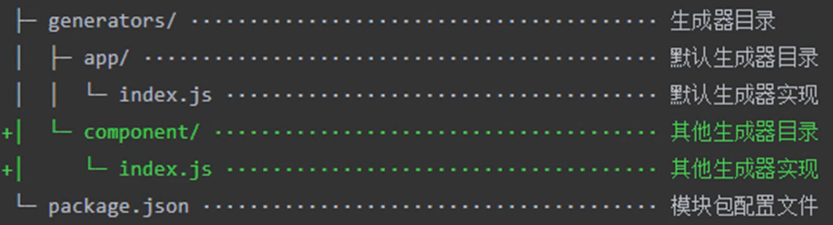

# 前端工程化

## 主要解决问题

- 传统语言或语法的弊端
- 无法使用模块化/组件化
- 重复机械式工作
- 代码风格统一/质量保证
- 依赖后端服务接口支持
- 整体依赖后端项目

## 工程化表现

工程化是对项目整体的规划和架构，工具只是落地的手段

### 创建项目

- 创建项目结构
- 创建特定类型文件

### 编码

- 格式化代码
- 校验代码风格
- 编译/构建/打包

### 预览、测试

- webserver、mock
- live reloading，hmr
- source map

### 提交

- git hook
- lint-staged
- 持续集成

### 部署

- ci/cd
- 持续集成

# 脚手架工具

创建项目基础结构，提供项目规范和约定

让开发人员不用自己每次都创建相同的组织结构，开发范式，模块依赖，工具配置，基础代码

### 常用脚手架

`vue-cli, angular-cli, create-react-app`只适用于自身技术项目开发，根据信息创建对应的项目基础结构

`yeoman`是通用型脚手架，可以根据配置文件创建项目

`Plop`是在开发过程中创建对应类型文件的工具，如创建一个组件、模块的基础文件

## Yeoman

通用型脚手架，可以通过搭配不同的generator创建不同类型的项目

```sh
yarn add yo global # 全局范围安装yeoman
yarn add generator-node # 全局范围安装generator
yo node # 运行对应的generator
```

### Sub Generator

用于在已有项目基础上创建某些文件，而不是创建完整项目，如readme，配置文件

运行方式为`yo <main-generator>:<sub-generator>`，如`yo node:cli`就可以创建一个基于node的命令行工具

每个generator支持的subGenerator是不一样的

### 自定义generator

本质上是个npm包，名称必须是`generator-<name>`结构是



#### index.js

- generator核心入口，需要导出一个继承自Yeoman Generator的类型
  - `const Generator = require('yeoman-generator')`
  - `module.exports = class extends Generator { ... }`
- yeoman工作时会调用我们在类型中定义的**生命周期方法**
- 方法中可以通过调用父类提供的工具实现功能，如文件写入

#### writing, 写入文件

在生成文件阶段调用

可以使用`this.fs`模块写文件，如

```js
this.fs.write(
    this.fs.destinationPath('temp.txt') // 文件路径
    Math.random().toString() // 文件内容
)
```

##### 模板

在`app/templates/`目录下放入模板文件，使用`this.fs.copyTpl(tmpl, outputPath, contextObject)`写入文件

模板使用[EJS模板语法](https://ejs.bootcss.com/)，如`<%= title %>, <% if %>`

如果需要原本地输出EJS模板, 需要再加个%: `<%%=, <%%`等

#### prompting, 得到用户输入

询问用户阶段调用, 可使用父类`prompt`方法发出命令行询问

```js
prompting() {
    return this.prompt([
        {
            type: 'input',
            name: 'name',
            message: 'the project name',
            default: this.appname // 项目生成目录名称
        }
    ]).then(anwsers => {
        // { name: <user input> }
        this.anwsers = anwsers
        // 之后便可在writing.template等使用用户输入
    })
}
```

### 发布generator

1. 发布到github
2. `yarn publish (--registry=https://registry.yarnpkg.com)`
3. 添加`yeoman-generator`关键词, 可以在yeoman官网搜索到

## Plop

用于在项目中创建同类型的文件, 类似于 yeoman sub generator

1. `yarn add prop --dev`
2. `propfile.js`
   1. 定义脚手架任务
3. 编写生成特定文件的模板(.hbs, [handlebars模板语法](https://handlebarsjs.com/))
4. `yarn prop <task name>`执行任务

```js
// propfile.js
module.exports = plop => {
  plop.setGenerator('component', {
    description: 'application component',
    prompts: [{
        type: 'input',
        name: 'name',
        message: 'component name'
    }],
    actions: [{
        type: 'add',
        path: 'src/components/{{name}}/{{name}}.js',
        templateFile: 'plop-templates/component.js.hbs'
    }, ...],
  }
}
// plop-templates/*.hbs
import React from 'react';

import './{{name}}.css';

export default () => (
  <div className="{{name}}">

  </div>
)
```

## 工作原理

1. `package.json中bin字段指定执行入口`
2. 入口文件必须有文件头`#!/usr/bin/env node`, unix like下还需要修改权限为755
3. 通过命令行交互获取用户输入
   1. 可以使用`inquirer`包的`prompt`方法通过命令行询问
4. 根据结果生成文件
   1. 创建`templates/*`模板文件
   2. 获得模板目录`teplPath = path.join(__dirname, 'templates')`
   3. 设定目标目录`destPath = process.cwd()`
   4. 遍历模板文件`fs.readdir(teplPath , (err, files) => {... files.forEach(fileName => ...)})`
   5. 使用`ejs`渲染模板文件, `ejs.renderFile(teplPath , context, (err, result) => { <write files> })`
   6. 将渲染结果写入目标路径`fx.writeFileSync(path.join(destPath, fileName), result)`

# 自动化构建

构建是将**源代码转换成生产环境代码**的过程

好处是在开发阶段脱离各种环境兼容问题, 方便使用高效率的语法,规范,标准等

如`ES Next, SASS, 模板引擎`等, 不能直接被浏览器支持, 所以需要构建过程转化成支持的特性

## 基本原理和流程

每个模块都可能有自己的构建命令, 通过`npm script`定义构建流程

```json
// package.json
{
    ...
    "scripts": {
        // sass构建工具将scss文件构建为css, --watch监听文件变化自动构建
        "build:sass": "sass scss/main.scss css/style.css --watch"
        // browser-sync启动简单的服务器, --files监听文件变化自动刷新浏览器
        "serve": "browser-sync . --files \"css/*.css\""
        // npm-run-all模块提供run-p, 并行执行多个任务, 因为监听文件会阻塞任务执行
        "start": "run-p build serve"
    }
}
```

## 常用自动化构建工具

### Grunt

最早的前端构建系统, 生态完善, 可以完成任何构建任务

构建过程基于临时文件, 需要磁盘文件, 速度较慢

### Gulp

基于内存实现, 支持同时执行多个任务, 速度快

命令更直观易懂, 生态良好, 后来居上, 最流行

### FIS

百度开源, 将许多典型需求

## Grunt

`yarn add grunt`, 配置文件为`gruntfile.js`,需要导出函数 `grunt => void`,grunt提供创建时提供的api

```js
// `--force`参数可以在任务失败后继续执行之后的任务
module.exports = grunt => {
    grunt.registerTask('foo', '任务描述', () => { return false }) // return false 标记任务失败
    grunt.registerTask('default', ['foo'])
    grunt.registerTask('async-task', function () {
        const done = this.async()
        setTimeout(() => {
            ...
            done(false) // done(false) 标记任务失败
        }, 1000)
    })
}
```

### initConfig

```js
grunt.initConfig( { foo: { bar: 123}} )
grunt.config('foo.bar') // 123
```

### regiterMultiTask

```js
// 需要再config中用<taskName>配置多目标
grunt.initConfig({
    myMultiTask: {
        options: { foo: 'bar' }, // build和所有子任务下都可以有个options用于配置, 同名子任务会覆盖build
        css: { options: { foo: 'baz' }, },
        js: '2'
    }
})
grunt.registerMultiTask('myMultiTask', function() {
    console.log(this.options())
    console.log(this.target, this.data)
})
```

### 插件

0. `yarn add grunt-contrib-<plugin-name>`

1. `grunt.loadNpmTasks('grunt-contrib-<plugin-name>')`

2. `grunt.initConfig({ <plugin-name>: configObj })`

   ```js
   grunt.initConfig({ clean: { temp: 'temp/**' } })
   grunt.loadNpmTasks('grunt-contrib-clean')
   ```

#### loadGruntTask

```js
// yarn add load-grunt-tasks --dev
const loadGruntTasks = require('load-grunt-tasks')
loadGruntTasks(grunt) // 自动加载所有已安装的grunt插件任务, 避免多个loadNpmTasks
```

#### sass

```js
// yarn add grunt-sass sass
const sass = require('sass')
grunt.initConfig({ sass: {
    options: {
        sourceMap: true,
        implementation: sass
    },
    main: { files: {
        'dist/css/main.css': 'src/sass/main.scss'
    }}
}})
```

#### babel

```js
// yarn ass grunt-babel @babel/core @babel/preset-env --dev
grunt.initConfig({ babel: {
    options: {
        sourceMap: true
        presets: ['@babel/preset-env'] // preset打包需要转换的特性, env指支持最新的ES特性
    },
    main: {
        files: { 'dist/js/app.js': 'src/js/app.js'}
    }
}})
```

#### watch

```js
// yarn add grunt-contrib-watch --dev
... watch: {
    js: {
        files: ['src/js/*.js'],
        tasks: ['babel']
    },
    css: {
        files: ['src/scss/*.scss'],
        tasks: ['sass']
    }
}
// watch不会进行第一次编译, 可以通过default任务进行首次编译
grunt.registerTsks('defualt', ['sass', 'babel', 'watch'])
```

## Gulp

```js
// 使用exports.<taskName>以导出函数的形式创建任务
// 所有gulp任务都是异步的, 需要手动执行done标识任务完成
// gulpfile.js
exports.foo = done => {
    console.log('foo')
    done()
}

// 旧版本定义方式, 不推荐
const gulp = require('gulp')
gulp.task('bar', done => { ... done() })
```

### 组合任务

```js
const { series, parallel } = require('gulp')
const task1 = ..., task2 = ..., task3 = ...
exports.foo = series(task1, task2, task3) // 顺序串行执行
exports.bar = parallel(...) // 并行执行
```

### 异步任务

1. 回调函数

   `done => done(), done => done(new Error('task failed'))`

2. promise

   `return Promise.resolve()`, `return Promise.reject(new Error())`

3. async/await

   ```js
   exports.async = async () => { await timeout(1000); console.log('async task') }
   ```

4. stream

   ```js
   const fs = require('fs')
   exports.stream = () => {
       const readStream = fs.createReadStream('package.json')
       const writeStream = fs.createWriteStream('temp.txt')
       readStream.pipe(writeStream)
       return readStream
       // 等效于readStream.on('end', () => done())
   }
   ```

### 构建过程

读取流 => 转换流 => 写入流

```js
const fs = require('fs')
const { Transform } = require('stream')
exports.default = () => {
    const read = fs.createReadStream('main.css')
    const write = fs.createWriteStream('main.min.css')
    const minimize = new Transform({
        transform: (chunk, encoding, callback) => {
            const input = chunk.toString()
            // 去除空白换行和注释
            const output = input.replace(/\s+/g, '').replace(/\/\*.+?\*\//g, '')
            callback(null, output)
        }
    })
    read.pipe(minimize).pipe(write)
    return read
}
```

```js
// gulp自带文件操作API, 支持强大的通配符匹配
const { src, dest } = require('gulp')
const clearCss = require('gulp-clean-css')
const rename = require('gulp-rename')

exports.default = () => {
    return src('src/*.css')
        .pipe(cleanCss())
        .pipe(rename({ extname: 'min.css' }))
        .pipe(dest('dist'))
}
```

### gulpfile.js样例

sass支持配置仓库url, 故可以使用镜像加速

`yarn config set sass_binary_site https://npm.taobao.org/mirrors/node-sass/`

imagemin不支持, 可以使用yarn的resolutions使用包替换解决

` "bin-wrapper": "npm:bin-wrapper-china"`

```js
const { src, dest, parallel, series, watch } = require('gulp')
const loadPlugin = require('gulp-load-plugins')
const del = require('del')
const browserSync = require('browser-sync')
// const sass = require('gulp-sass')
// const babel = require('gulp-babel')
// const swig = require('gulp-swig')
// const imagemin = require('gulp-imagemin')

const data = {
    menu: [],
    pkg: require('./package.json'),
    date: new Date()
}
const plugins = loadPlugin()
const bs = browserSync.create()

const clean = () => {
    return del(['dist', 'temp'])
}

const style = () => {
    return src('src/assets/styles/*.scss', { base: 'src' }) // 将base之下的文件保持原路径信息
        .pipe(plugins.sass({ outputStyle: 'expanded' })) // 完全展开, 右括号单独成行
        .pipe(dest('temp')) // dest是目标, dist是分发, 构建后文件标准文件夹名
}

const script = () => {
    return src('src/assets/scripts/*.js', { base: 'src' })
    	// babel类似平台, 需要通过presets进行具体的编译
        .pipe(plugins.babel({ presets: ['@babel/preset-env']}))
        .pipe(dest('temp'))
}

const page = () => {
    return src('src/**/*.html', { base: 'src' })
        .pipe(plugins.swig({ data }))
        .pipe(dest('temp'))
}

const image = () => {
    return src('src/assets/images/**', { base: 'src' })
        .pipe(plugins.imagemin())
        .pipe(dest('dist'))
}

const font = () => {
    return src('src/assets/fonts/**', { base: 'src' })
        .pipe(plugins.imagemin())
        .pipe(dest('dist'))
}

const extra = () => {
    return src('public/**', { base: 'public' })
        .pipe(dest('dist'))
}

const serve = () => {
    watch('src/assets/styles/*.scss', style)
    watch('src/assets/scripts/*.js', script)
    watch('src/*.html', page)
    watch([
        'src/assets/images/**',
        'src/assets/fonts/**',
        'public/**',
    ], bs.reload)

    bs.init({
        notify: false,
        port: 2080, // default 3000
        open: false, // 更新后自动打开浏览器
        // 监视文件变动, 自动刷新页面
        // 可以在每个相关task后.pipe(bs.reload({ stream: true })), 达到相同效果
        files: 'temp/**',
        server: {
            baseDir: ['temp', 'src', 'public'], // 请求时按顺序访问, 直到找到
            routes: {
                '/node_modules': 'node_modules'
            }
        }
    })
}

const useref = () => {
    return src('temp/*.html', { base: 'temp' }) // 需要在构建完成后再进行
        // 会将构件注释中的资源合并到一个文件中
        // 通常用于合并引入的第三方代码
        /**
         *  <!-- build:js assets/scripts/vendor.js -->
            <script src="/node_modules/jquery/dist/jquery.js"></script>
            <script src="/node_modules/popper.js/dist/umd/popper.js"></script>
            <script src="/node_modules/bootstrap/dist/js/bootstrap.js"></script>
            <!-- endbuild -->
             ===>
            <script src="assets/scripts/vendor.js"></script>
         */
        .pipe(plugins.useref({ searchPath: ['temp', '.'] }))
        // 将不同类型文件用对应插件进行压缩
        .pipe(plugins.if(/\.js$/, plugins.uglify()))
        .pipe(plugins.if(/\.css$/, plugins.cleanCss()))
        .pipe(plugins.if(/\.html$/, plugins.htmlmin({
            collapseWhitespace: true,
            minifyCSS: true,
            minifyJS: true
        })))
        // 因为是同步读写, 若写入到同一个目录可能会产生冲突
        // 故构建后的放到temp, release放到dist
        .pipe(dest('dist'))
}

const compile = parallel(style, script, page)

const build = series(
    clean,
    parallel(
        series(compile, useref),
        image,
        font,
        extra,
    )
)

const dev = series(compile, serve)

module.exports = {
    clean,
    build,
    dev,
}
```

### 封装工作流

实现**可复用的构建工作流**, 便于类似项目复用和维护通用的工作流, 可以维护多个项目的gulpfile

1. 将gulpfile提取到一个npm模块中导出, 如`lib/index.js`

2. 提取配置文件

   1. 约定配置文件名, 如`page.config.js`和配置项, 如 `data: ..., build: ...`

   2. 设置默认配置项, 读入用户配置并合并

      ```js
      let config = { <default config> }
      try {
          const loadConfig = require(`${cwd}/page.config.js`)
          config = Object.assign({}, config, loadConfig)
      } catch (e) { ... }
      ```

   3. 将babelfile中的数据等替换为配置项

   4. 将其中使用到的package替换为`require`形式, 如 `'@babel/preset-env' => require('@babel/preset-env')`

      因为普通字符串只会在cwd目录下找package, 而require会从当前目录逐层往上找

   5. 将所有写死的路径抽象到配置中

      1. src方法可以配置工作目录: `{ base: config.build.src, cwd: config.build.src }`

3. 包装一个命令行工具, 隐藏gulp包, 使得用户不再需要手动加gulpfile

   1. package中增加bin路径

   2. bin文件中通过调用node_modules中的gulp并传入参数工作

      ```js
      // 指定工作目录为当前工作目录, 这样才能编译当前项目的文件
      process.argv.push('--cwd')
      process.argv.push(process.cwd())
      // 指定gulpfile目录
      process.argv.push('--gulpfile')
      // 检查文件是否存在并获取文件的绝对路径
      // 如果参数是目录, 会自动以目录下package.json:main文件为目标
      // 这里就导入了index.js, 即gulpfile
      process.argv.push(require.resolve('..'))
      // 调用gulp命令
      require('gulp/bin/gulp')
      ```

4. 发布npmpackage, `npm publish`

### FIS

高度集成一些常用任务, 当前不再流行

1. 配置文件`fix-config.js`

2. `fis3 release -d output`进行构建

3. 自动进行资源定位, 将相对路径变为绝对路径

   ```js
   fis.match(*.{js,scss,png}, {
     release: 'assets/$0' // $0指原始目录结构
   })
   ```

4. 通过通配符和插件对同一类型文件进行构建

   ```js
   fis.match('**/*.scss', {
       rExt: '.css', // 重写文件扩展名
       parser: fis.plugin('node-sass'),
       optimizer: fis.plugin('clean-css')
   })
   fis.match('**/*.js', {
       parser: fis.plugin('babel-6.x'),
       optimizer: fis.plugin('uglify-js')
   })
   ```

5. `fis3 inspect`进行输出具体构建过程, 方便调试


